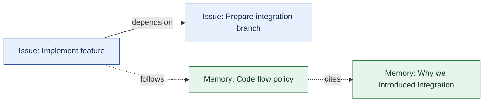
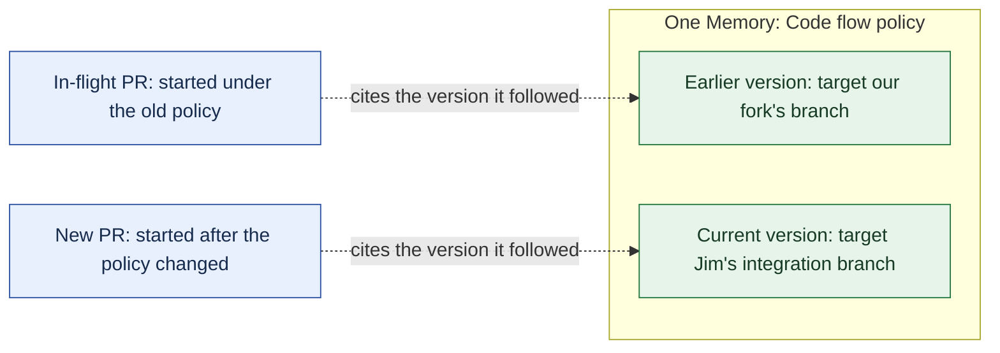

# Extending Beads Beyond Issues

<!-- Working draft for Donna. Edit freely. This is a blog draft, not a specification or a claim that proposed Beads features have shipped. -->

## Beads, Issues, and Dependencies, oh my!

Beads has been a wildly successful way to keep agents on task. But tasks aren't the only things we need them to remember.

Steve [introduced Beads in October 2025](https://steve-yegge.medium.com/introducing-beads-a-coding-agent-memory-system-637d7d92514a), after running into the limits of asking agents to keep track of a large development effort. Less than a year later, the [repository](https://github.com/gastownhall/beads) has more than 27,000 stars, 1,800 forks, and [well over a million binary downloads](https://github.com/gastownhall/beads/releases) (as of September 30, 2026). Pretty good for an issue tracker.

<!-- Adoption figures checked September 30, 2026 via GitHub REST API: gastownhall/beads has 27,550 stars and 1,873 forks. Summing download_count for 640 platform-binary assets across 103 releases gives 1,283,766 downloads; excludes checksums, SBOMs and contract-corpus archives. Includes prereleases and repeat downloads; this is not a count of unique users or installations. Sources: https://api.github.com/repos/gastownhall/beads and paginated https://api.github.com/repos/gastownhall/beads/releases?per_page=100 -->

What's interesting is how naturally beads fit into an agent's work. An agent can record something it discovered, connect it to work already in progress, and ask what's ready to do next. When that agent runs out of context, the work is still there. The community that creates and maintains Beads has given us a useful foundation, and they've done it without requiring every coding agent to grow its own project management system.

Beads was originally built as a way to track work for both agents and humans. As users look to expand the utility of beads, there are numerous scenarios emerging that don't fit neatly into the way beads organizes information. The primary way information is modeled in beads today is as _Issues_, and the relationships between Issues are modeled as _Dependencies_.

An Issue comes with some fairly specific expectations. Someone can claim it. It can be blocked. Eventually, someone may close it. These are useful semantics when the thing you're modeling is work.

Consider a project's code flow policy: where to branch from, which branch a PR should target, and what checks must pass before merging. An agent needs that guidance while doing the work. Putting it in an Issue makes it available in the system the agent already uses to track that work.

But what does it mean to close that Issue? Have we finished writing the policy, stopped following it, or just made it harder to find? And if an implementation Issue depends on the policy, is the work blocked until someone closes it? The policy needs to remain available and evolve as the project changes. Treating it as another task leaves every caller to remember which Issues aren't really Issues.

Updating the code flow policy is work we can finish. The policy itself needs to remain available after that work is done. We want an Issue for the change and a Memory for the knowledge it leaves behind, with a Link connecting them.

We’re extending Beads so Issues and Memories can live in the same graph. Agents can keep using Issues to track work, store lasting knowledge in Memories, and follow Links between them.

## Beads and Memory

A memory is information we want available beyond the current conversation: a project policy, a decision and its reasoning, or something an agent learned while doing the work. Humans and agents can both contribute it.

An agent figures out why a particular approach won't work, you agree on an alternative, and then the session ends. A few days later, another agent proposes the same approach. You get to have the conversation again. Sometimes with the same agent.

The work tracker can tell us that a task is done. We also want to help the next person understand why we did it that way. That knowledge needs to survive the conversation and the work, and it needs to be findable from the work it explains.

Beads already has a small memory system. `bd remember` stores text under a key, `bd recall` reads it, and `bd memories` lists or searches what we've saved. `bd prime` can put those memories into an agent's starting context. This is useful, especially for a handful of project reminders.

But a keyed string only gets us so far. The memory commands don't give each entry a canonical Bead identity, explicit Links, or addressable versions with change attribution. If I change the target branch in our code flow policy, an in-flight PR can't cite the exact policy state it followed through those commands. And loading all the bodies at startup spends context before the agent knows which ones matter. These are the gaps [Chris' Memory Beads proposal](https://github.com/gastownhall/beads/issues/5877) is trying to close.

A stable identity lets us keep referring to the same policy as it changes. Links connect that policy to the work it guides and the decisions behind it. Versions let an older PR cite the instructions it actually followed.

The proposed Memory Bead has an identity, a title, and a Markdown body. A task can link to it. It can link to other memories. A caller can discover a few promising memories and then explicitly read the ones it needs. Changes participate in shared Beads History, so a caller can inspect an earlier state and see the attribution recorded with it.

Unlike an Issue, a Memory doesn't become ready or blocked, and we don't close it when we've finished reading it. We can correct it or retire it. The proposal keeps retained history available after deletion and treats erasing that history as a separate operation. That seems like a much better fit for project knowledge.

## Generalizing the data model

At this point, we could build a memory store beside the Issue store and add some special machinery to connect them. Then we'd have two answers to questions like how to identify a record, read its properties, or follow a relationship. Every tool that wanted to work with both would get to learn both.

Instead, we're making the common model explicit and defining Memory in terms of it. Issues participate in that model too. The test for this generalization is fairly concrete: can an implementation Issue depend on a prerequisite Issue, cite a code flow policy Memory, and let us follow that policy's Links to the reasoning behind it? Can it do that while the existing Issue workflow continues to make sense? That's the first graph people should be able to use.

A Bead is an identified, typed thing with properties. A Link is an identified, typed, directed relationship with properties of its own. Together, they form a graph; Beads are nodes, Links are edges. An Issue and a Memory are different kinds of Bead; a blocking Dependency is a kind of Link between Issue-typed Beads.



*Figure 1. Work and knowledge in the same graph. The solid edge is a blocking Dependency; dashed edges are informational Links. Relationship labels describe their purpose.*

Giving Links their own identity matters. We can read a particular Link, change its properties, or remove it without guessing which relationship between two Beads the caller intended. In the proposed model, its Type and endpoint References stay fixed; changing which Beads are linked means deleting the Link and creating a new one.

The meaning of a Bead or Link still comes from the Type. Closing a prerequisite can make an implementation Issue ready. Editing a policy Memory doesn't. An informational Link to that policy doesn't acquire blocking behavior just because one endpoint happens to be an Issue. The [generic graph CLI proposal](https://github.com/gastownhall/beads/issues/6703) describes how the familiar commands could work over this model.

We also need room for application-specific data to be attached to Beads and Links. The Beads proposal calls that extension point `metadata`: an open record on both Beads and Links. A tool can record a confidence value or a validity window without coining a Type for every variation.

## Beads Protocol

As described so far, a graph of Beads and Links can live in one project. But the code flow policy might belong to the team, while the task following it belongs to one of the team's repositories. Copying the policy into every project creates another problem: which copy did we use, and which copies need to change when the team corrects it?

This is where the Bead Protocol, or [BDP](https://github.com/gastownhall/bdp), comes in. It defines the shared data model and an HTTP interface for working with it. A viewer should be able to read a Bead, inspect its Type, and follow its Links without knowing the database schema behind the server. The same is true of an agent or a tool assembling context for one. In Beads, the CLI and the BDP HTTP front end use the same underlying engine and storage.

Types make these distinctions something tools can understand. In BDP, a Bead or Link has one declared Type, identified by a URL. Its Type descriptor can supply a JSON Schema for its properties and, for a Link, constraints on its endpoints. A Type can also conform to other Types, but it must satisfy every contract it declares.

BDP calls the owning boundary a _Scope_. A Scope has a canonical base URL, and each Bead and Link belongs to exactly one Scope. For example, within `https://beads.example/team/`, the local identity `beads/code-flow-policy` resolves to `https://beads.example/team/beads/code-flow-policy`. Links have their own identities under `links/`. The rest of the path is an identifier; slashes don't secretly create folders or nested Scopes.

A Link can cross a Scope boundary. The project can keep a Link from its implementation Issue to the team's code flow policy without importing the team's entire database. At least one endpoint belongs to the Scope holding the Link; an endpoint outside it is carried as a Reference, which is the URL to the Bead in another Scope. Reading that target is a separate operation, with its own availability and authorization checks. The URL tells us where to find the Bead; access still requires permission.

There are limits to what this buys us. A local write can't guarantee that another Scope will remain online or retain a policy forever, and it doesn't become a transaction across both stores. We need to be explicit about that. Cross-Scope Links let us record the relationship without pretending we own the other end.

## Versioning

The proposed model makes earlier states addressable so a citation can keep its meaning as the graph changes.

Let's say we introduce a new integration branch. We update the code flow policy so agents know where to base new work and send new PRs. But branches and PRs are already in flight under the previous policy. Reading only today's instructions can make those earlier choices look wrong. Retaining the old version lets us understand that work against the code flow model it followed.

That gives us two useful ways to refer to a Bead. We can follow its current state using just its URL, or pin a Reference to one exact retained version. Both are useful. An agent starting a new branch needs the current policy; an in-flight PR should be able to cite the version it followed. Changing the policy later must not change the meaning of that citation.



*Figure 2. The proposed versioned-reference model keeps both citations meaningful as the policy changes. These are two versions of one Memory, not two separate policies; the PR boxes represent work referring to that Memory.*

Relationships need to participate too. If a Memory cites a different source after an edit, its text might be unchanged while its meaning has changed substantially. In BDP, a Type can declare ownership of outgoing Link Types. Changing one of those owned Links changes the source Bead's version, and the old state preserves the old owned Links. Merely pointing at another Bead doesn't version the target.

There is also the more immediate problem of two agents editing the same record. Each should be able to say which revision it started from. If another write has landed, a guarded write fails so the caller can read the new state and decide what to do. The Memory proposal also allows unguarded writes, but requires the result to identify the version replaced and its attribution. Keeping history doesn't excuse a silent overwrite.

Retained history needs a clear contract: an old address must continue to mean the same state, and a store that can no longer serve that state must say so. It must never substitute the current version. BDP's historical resolution capability makes that promise explicit; clients discover whether a store offers it. The [BDP specification](../specs/bdp.md) describes the detailed rules for identities, Types and conditional operations.

## Try it out and let us know what you think!

If you'd like to try this as we build it, you can! Our [integration branch](https://github.com/versioned-beads/beads/tree/integration) has the first pieces ready to explore. This is a preview: some of the model described above is still being implemented, and this work hasn't landed in upstream Beads yet. The [graph CLI guide](https://github.com/versioned-beads/beads/blob/integration/docs/reference/graph-cli.md) walks through the current commands; the [technical reference](https://github.com/versioned-beads/beads/blob/integration/docs/reference/graph-preview.md) records their bounds and unsupported operations. Both can evolve after this post is published.

Use `bd` built from the integration branch, rather than a released Beads binary. From a fresh parent directory, build with Go 1.26.7 or the toolchain selected by the repo:

```sh
git clone --branch integration https://github.com/versioned-beads/beads.git
cd beads
CGO_ENABLED=1 go build -tags gms_pure_go -o ./bd ./cmd/bd
export PATH="$PWD:$PATH"
cd ..
```

In another terminal, start an ordinary Dolt SQL server using a new data directory; leave it running during the walkthrough:

```sh
mkdir -p memory-beads-dolt
dolt sql-server --host 127.0.0.1 --port 3306 --data-dir "$PWD/memory-beads-dolt"
```

Start the Beads example in a **new** directory with no existing `.beads` workspace; this preview does not migrate an existing Issue database or an older graph-preview schema. BDP serving currently requires shared-server mode. For an embedded-only CLI walkthrough, see the [graph CLI guide](https://github.com/versioned-beads/beads/blob/integration/docs/reference/graph-cli.md).

> **Draft review note:** This walkthrough includes the agreed CLI defaults that are still being implemented. It has not yet passed end-to-end validation; the final command sequence and build instructions will be checked against the publication commit.

<!-- Publication gate: validate this complete installed-process recipe at the final integration commit after CLI PR71/72 land. Do not publish it as a working recipe while its command surface exists only in open PRs. -->

```sh
mkdir memory-beads-demo
cd memory-beads-demo
git init
bd init --graph-mode link --scope-url http://127.0.0.1:8765/demo/ \
  --server --external --server-host 127.0.0.1 --server-port 3306 \
  --server-user root --skip-hooks --non-interactive

# Inspect the capabilities and limits of this build.
bd status --graph
bd types

# Record the current code flow policy and read it back.
bd remember "Base new work on our fork's integration branch and target PRs there. Merge only after CI passes." \
  --id beads/code-flow-policy --title "Code flow policy"
bd recall code-flow-policy

# Update the same Memory when the integration target changes.
bd remember "Base new work on Jim's integration branch and target PRs there. Merge only after CI passes." \
  --update code-flow-policy
bd versions code-flow-policy

# Track adopting the new policy as work, and link the policy to that Issue.
bd create "Move new work to Jim's integration branch" --id adopt-integration
bd link code-flow-policy adopt-integration \
  --link-type types/preview-related-v2
bd links code-flow-policy
bd list --format records-json --all

# Start the read-only BDP endpoint. Leave this running.
bd serve --readonly --addr 127.0.0.1:8765
```

A Memory owns its outgoing informational Links, so changing one also changes the Memory's version. By default, these writes accept the current state; no guard flag is required. For an edit based on a previously read version, use `--if-source-revision TOKEN` on a Link write or `--if-revision TOKEN` on a Memory body update. A stale token rejects the change. Explicit `--unconditional-source` and `--unconditional` remain available to spell out the default.

`bd versions BEAD` lists versions newest first in graph mode; `bd history BEAD` is an alias there. Each row carries an opaque version token and a store-local ordering number. Use the **token** with `bd show BEAD --version TOKEN` or `bd compare BEAD --from TOKEN --to TOKEN`; the number is not a portable version address. `bd memories` searches current Memories, not their history. BDP HTTP History and restoration are still ahead.

In another terminal, read and enumerate the Beads through BDP HTTP:

```sh
curl --fail http://127.0.0.1:8765/demo/beads/code-flow-policy
curl --fail http://127.0.0.1:8765/demo/beads/adopt-integration
curl --fail 'http://127.0.0.1:8765/demo/beads/?limit=1'
```

The collection response includes `items` and a `next` URL. Follow that complete URL until `next` is null to enumerate the collection. The [Python example](https://github.com/versioned-beads/beads/tree/integration/examples/bdp-read) demonstrates BDP reads and pagination using the standard library. Scripts read through BDP HTTP; they do not need to invoke the CLI. The local listener uses HTTP, not HTTPS.

Graph initialization also installs guidance in `AGENTS.md`, including Stephanie Jarmak's instructions for remembering useful knowledge. Our integration tests check that the guidance is installed and that its example commands work. Whether an agent chooses the right things to remember is something we'd like your help evaluating. Try it with your agent and tell us what it saves, what it retrieves, and what it misses.

The integration branch brings Memory creation and editing, mixed Issue/Memory Links, local version listing, and BDP HTTP reads together. HTTP writes and HTTP History are still ahead. The [graph CLI guide](https://github.com/versioned-beads/beads/blob/integration/docs/reference/graph-cli.md) is the evolving command walkthrough; the [technical reference](https://github.com/versioned-beads/beads/blob/integration/docs/reference/graph-preview.md) has the detailed matrix and limits.

Try the workflow on a small project and tell us where it helps—or gets in your way. Join the conversation in the Gas Town Hall Discord's `#beads` and `#memory-beads` channels, or [file a Beads issue](https://github.com/gastownhall/beads/issues) with a `[Memory]` or `[BDP]` prefix. Include the integration commit you tried so we can reproduce what you saw.

---

## Working references

- [Memory Beads proposal](https://github.com/gastownhall/beads/issues/5877)
- [Generic graph CLI proposal](https://github.com/gastownhall/beads/issues/6703)
- [BDP specification](../specs/bdp.md)
- [Repository implementation status](../../STATUS.md)

<!-- Editorial reminders: deletion, repinning, nominal Issue Types, metadata placement, and compatibility defaults still need reconciliation across proposals. Do not present an open choice as settled. Keep the implementation plan/review in donnabox/beads. -->
